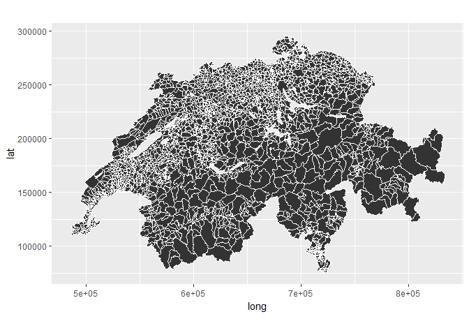
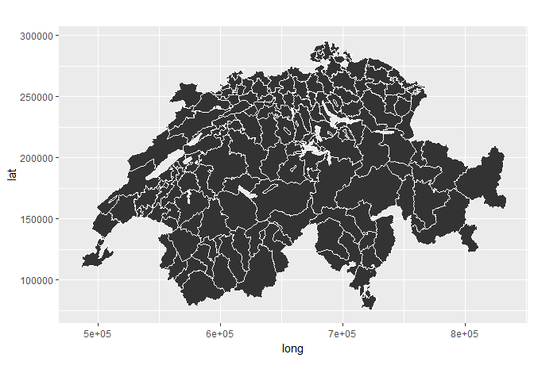

<!-- README.md is generated from README.Rmd. Please edit that file -->
suistats
========

The goal of suistats is to use of data from the Federal Statistical Office of Switzerland easier within R. But that is a long-term goal. We start with using their Swiss map. Find examples below.

Installation
------------

You can install it with:

``` r
devtools::install_github("tinino/suistats")
```

Example
-------

Plot municipalities:

``` r
library(ggplot2)
library(suistats)
ggplot(data = make_layer_data(agg_level = "GDNR"),
       mapping = aes(x = long, y = lat, group = group)) +
  geom_polygon() +
  geom_path(color = "white") +
  coord_equal()
#> Loading required package: sp
```



Plot districts:

``` r
ggplot(data = make_layer_data(agg_level = "BZNR"),
       mapping = aes(x = long, y = lat, group = group)) +
  geom_polygon() +
  geom_path(color = "white") +
  coord_equal()
```


